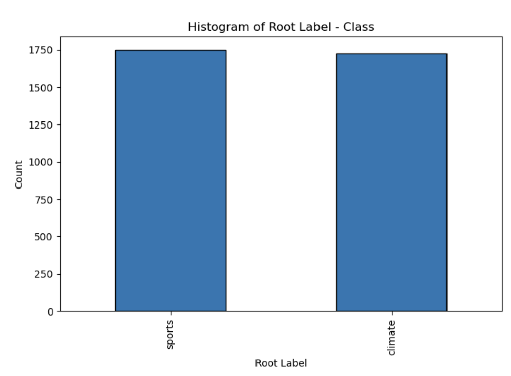

## **QUESTION 1:** Provide answers to the following questions:

### • *Overview:* 

How many rows (samples) and columns (features) are present in the dataset?


### • *Histograms:*

 Plot 3 histograms on : (a) The total number of alpha-numeric characters per data point (row) in the feature full text: i.e count on the x-axis and frequency on the y-axis; (b) The column leaf label – class on the x-axis; (c) The column root label – class on the x-axis.

### • *Interpret Plots:* 

Provide qualitative interpretations of the histograms.


1. **Histogram of Alpha-Numeric Characters per Data Point:**

   - This histogram represents the distribution of the total number of alpha-numeric characters in each data point (row) of the 'full_text' feature.

   - The x-axis shows the count of alpha-numeric characters, while the y-axis represents the frequency (number of data points).

   - Interpretation: If the histogram is skewed towards the left, it indicates that many data points have fewer alpha-numeric characters. If it's skewed to the right, some data points have a higher count of alpha-numeric characters.


2. **Histogram of Leaf Label - Class:**
- This histogram displays the distribution of classes in the 'leaf_label' column.
   - The x-axis shows different leaf labels, and the y-axis represents the count of each leaf label.
   - Interpretation: It provides insights into the distribution of samples across different leaf labels. A balanced distribution suggests an even representation of different leaf labels, while imbalances may indicate a skewed dataset towards certain classes.



3. **Histogram of Root Label - Class:**

   - This histogram shows the distribution of classes in the 'root_label' column.
   - The x-axis displays different root labels, and the y-axis represents the count of each root label.
   - Interpretation: Similar to the leaf label histogram, this plot offers insights into the distribution of samples across different root labels. It helps understand the hierarchical arrangement of classes, revealing which root labels are more or less prevalent in the dataset.

## **QUESTION 2:** Report the number of training and testing samples.


## **QUESTION 3:** Use the following specs to extract features from the textual data:

• Before doing anything, please clean each data sample using the code block provided above.

• Use the “english” stopwords of the CountVectorizer

• Exclude terms that are numbers (e.g. “123”, “-45”, “6.7” etc.)

• Perform lemmatization with nltk.wordnet.WordNetLemmatizer and pos tag

• Use min df=3

Please answer the following questions:

### • What are the pros and cons of lemmatization versus stemming? How do these processes affect the dictionary size?

#### Lemmatization:

- Pros:
  - Retains the base or dictionary form of a word, making it more interpretable.
  - Produces meaningful words, enhancing the understanding of the text.
- Cons:
  - Can be computationally expensive and slower compared to stemming.
  - Requires a complete dictionary, which may not cover all words or may need constant updates.

#### Stemming:

- Pros:
  - Generally faster and less computationally intensive.
  - Reduces words to their root form, effective in certain applications.
- Cons:
  - May produce non-dictionary words that are harder to interpret.
  - Can result in over-stemming or under-stemming, leading to loss of meaning.

### How these processes affect the dictionary size:

- Lemmatization tends to result in a larger dictionary size since it retains meaningful base words.
- Stemming may reduce the dictionary size by reducing words to their root forms.

### • min_df means *minimum document frequency*. How does varying min_df change the TF-IDF matrix?

- Increasing min_df means excluding terms with lower document frequency, reducing the impact of rare terms on the TF-IDF matrix.

- Higher min_df may lead to a sparser matrix with fewer features, focusing on more common terms.

like this figure shown below:


### • Should I remove stopwords before or after lemmatizing? Should I remove punctuations before or after lemmatizing? Should I remove numbers before or after lemmatizing? Hint: Recall that the full sentence is input into the Lemmatizer and the lemmatizer is tagging the position of every word based on the sentence structure.

Order of Text Processing Steps:

#### Stopwords, Punctuation, Numbers, and Lemmatization:

- **Stopwords:** removed after lemmatization; 
- **Punctuation:** removed before lemmatization to ensure accurate tokenization.
- **Numbers:** removed before lemmatization to avoid potential issues with word tagging.

###  • Reporting the shape of the TF-IDF-processed train and test matrices:


## **QUESTION 4:** Reduce the dimensionality of the data using the methods above:

### • Plot the *explained variance ratio* across multiple different *k* = [1*,* 10*,* 50*,* 100*,* 200*,* 500*,* 1000*,* 2000] for LSI and for the next few sections choose *k* = 50. What does the explained variance ratio plot look like? What does the plot’s concavity suggest?


• With *k* = 50 found in the previous sections, calculate the reconstruction residual MSE error when using LSI and NMF – they both should use the same *k* = 50. Which one is larger, the ∥**X** *−* **WH**∥ 2 *F* in NMF or the ∥**X** *−* **U**k***Σ***k***V**T k*∥2 *F* in LSI and why?


NMF is larger and it's possible that the factorization performed by NMF did not capture the underlying patterns in the data as effectively as the factorization performed by LSI.

## **QUESTION 5:** Compare and contrast hard-margin and soft-margin linear SVMs:

### • Train two linear SVMs:

**–** Train one SVM with *γ* = 1000 (hard margin), another with *γ* = 0*.*0001 (soft margin).

**–** Plot the ROC curve, report the **confusion matrix** and calculate the **accuracy**, **recall**, **precision** and **F-1 score** of both SVM classifiers on the testing set. Which one performs better? What about for *γ* = 100000?

for one SVM with *γ* = 1000 (hard margin), another with *γ* = 0*.*0001 (soft margin).


which one is better?:

Hard SVM is better.

for one SVM with *γ* = 100000 (hard margin), another with *γ* = 0*.*0001 (soft margin).


which one is better?:

still hard_margin SVM

**–** What happens for the soft margin SVM? Why is the case? Analyze in terms of the confusion matrix.

This confusion matrix indicates that the Soft SVM is predicting all instances as the negative class ('climate'). There are no true positives or false positives for the 'sports' class. This leads to the following observations:

1. **Imbalanced Classes:** The dataset seems to be highly imbalanced, with a large number of instances belonging to the 'climate' class. In such cases, a model may tend to predict the majority class more frequently, especially when using a small regularization parameter (*γ*).
2. **Small Margin Effect:** A very small value of *γ*=0.0001*γ*=0.0001 in the Soft SVM results in a very small penalty for misclassification. This can lead to decision boundaries that are less sensitive to individual data points, causing the model to be biased towards the majority class.
3. **Class Imbalance Impact:** The model is biased towards predicting the majority class ('climate') due to the lack of penalty for misclassifying instances. As a result, the Soft SVM essentially predicts the negative class for all instances.

∗ Does the ROC curve reflect the performance of the soft-margin SVM? Why?

The ROC curve may not be informative or reflective of the model's performance. The reason is that the model is essentially predicting only the negative class ('climate') for all instances, resulting in no true positives or false positives. As a result, the true positive rate and false positive rate remain constant across different threshold settings, leading to a straight line in the ROC space.

• Use **cross-validation** to choose *γ* (use average validation 3 accuracy to compare): Using a 5-fold cross-validation, find the best value of the parameter *γ* in the range *{*10*k* *| −* 3 *≤* *k* *≤*6*, k* *∈* Z*}*. Again, plot the ROC curve and report the confusion matrix and calculate the **accuracy**, **recall precision** and **F-1 score** of this best SVM.


so the best value of γ is 10.


## **QUESTION 6:** Evaluate a logistic classifier:

### • Train a logistic classifier without regularization (you may need to come up with some way to approximate this if you use sklearn.linear model.LogisticRegression); plot the ROC curve and report the confusion matrix and calculate the **accuracy**, **recall precision** and **F-1** **score** of this classifier on the testing set.


### • Find the optimal regularization coefficient:

**–** Using 5-fold cross-validation on the dimension-reduced-by-SVD training data, find the optimal regularization strength in the range *{*10*k* *|−*5 *≤* *k* *≤* 5*, k* *∈* Z*}* for logistic regression with L1 regularization and logistic regression with L2 regularization, respectively.

The optimal regularization strength for L1 is 0.1,

The optimal regularization strength for L2 is 0.1


**–** Compare the performance (accuracy, precision, recall and F-1 score) of 3 logistic classifiers: w/o regularization, w/ L1 regularization and w/ L2 regularization (with the best parameters you found from the part above), using test data.

L1: regulation strength 0.1

L2: regulation strength 0.1


**–** How does the regularization parameter affect the test error? How are the learnt coefficients affected? Why might one be interested in each type of regularization?

1. L1 Regularization (Lasso):

- **Effect on Test Error:**
  - L1 regularization encourages sparsity in the learned coefficients, driving some of them to exactly zero.
  - It can be useful for feature selection by eliminating irrelevant or redundant features.
  - The sparsity induced by L1 regularization can lead to a simpler model, reducing the risk of overfitting.
- **Effect on Learned Coefficients:**
  - L1 regularization tends to produce sparse coefficient vectors, with many coefficients being exactly zero.
  - It selects a subset of features, effectively performing feature selection.
- **Why Interested:**
  - Useful when dealing with high-dimensional datasets with many irrelevant or redundant features.
  - Provides a form of automatic feature selection.

2. L2 Regularization (Ridge):

- **Effect on Test Error:**
  - L2 regularization penalizes the magnitude of the coefficients without enforcing sparsity.
  - It generally helps prevent large coefficients, reducing the risk of overfitting.
  - It can improve the generalization performance by making the model more robust.
- **Effect on Learned Coefficients:**
  - L2 regularization tends to shrink all coefficients towards zero but rarely exactly to zero.
  - It helps in reducing the impact of individual features without eliminating them entirely.
- **Why Interested:**
  - Suitable when all features are expected to contribute to the prediction, but their magnitudes need to be controlled.

3. Elastic Net Regularization:

- **Effect on Test Error:**
  - Elastic Net combines both L1 and L2 regularization, providing a balance between sparsity and controlling the magnitude of coefficients.
  - It is effective in situations where both feature selection and magnitude control are important.
- **Effect on Learned Coefficients:**
  - It results in a compromise between L1 sparsity and L2 magnitude control.
- **Why Interested:**
  - Offers a flexible approach that can handle situations where both L1 and L2 regularization have their advantages.

4. Regularization Parameter (*λ* or *C*):

- **Effect on Test Error:**
  - The regularization parameter controls the trade-off between fitting the training data and preventing overfitting.
  - A higher value of *λ* or a lower value of *C* increases the regularization strength, leading to a simpler model.
- **Effect on Learned Coefficients:**
  - Higher values of *λ* or lower values of *C* result in smaller coefficients.
- **Why Interested:**
  - Helps in tuning the model's complexity to achieve better generalization on unseen data.
  - Prevents overfitting by controlling the impact of individual features.

**–** Both logistic regression and linear SVM are trying to classify data points using a linear decision boundary. What is the difference between their ways to find this boundary? Why do their performances differ? Is this difference statistically significant?

1. **Decision Boundary:**

- Logistic Regression:
  - Logistic Regression uses the logistic (sigmoid) function to model the probability that a data point belongs to a particular class.
  - The decision boundary is chosen to maximize the likelihood of observing the given set of labels under the logistic regression model.
- Linear SVM:
  - Linear SVM aims to find a hyperplane that separates the data into classes while maximizing the margin between the classes.
  - The decision boundary is the hyperplane that maintains the largest margin between the nearest data points of the two classes.

2. **Optimization Objective:**

- **Logistic Regression:**
  - Logistic Regression minimizes the negative log-likelihood of the observed labels given the input features.
  - It uses a probabilistic approach and aims to model the conditional probability distribution of the classes.
- **Linear SVM:**
  - Linear SVM minimizes a hinge loss function, which penalizes misclassifications and encourages a larger margin.
  - SVM aims to find the hyperplane that maximizes the margin between classes while minimizing the classification error.

3. **Margin:**

- **Logistic Regression:**
  - Logistic Regression does not explicitly focus on maximizing the margin between classes.
  - The emphasis is on modeling probabilities, and the decision boundary is influenced by the likelihood of class membership.
- **Linear SVM:**
  - Linear SVM explicitly aims to maximize the margin between classes.
  - The decision boundary is chosen to be the hyperplane that maintains the largest margin, making the model more robust to noise.

4. **Output Interpretation:**

- **Logistic Regression:**
  - Logistic Regression provides probability estimates for each class.
  - The output can be interpreted as the probability of a data point belonging to a particular class.
- **Linear SVM:**
  - Linear SVM does not provide direct probability estimates.
  - Decision values (distances from the hyperplane) are used to make predictions, and additional steps may be needed for probability estimation.

Performance and Statistical Significance:

The performance of Logistic Regression and Linear SVM can differ based on the characteristics of the data. The choice between them depends on the specific problem at hand, the dataset, and other considerations.

- **Performance Differences:**
  - In some cases, Logistic Regression might perform better when the classes are well-separated in probability space.
  - Linear SVM might be more effective when there is noise in the data or when a clear margin between classes is desirable.
- **Statistical Significance:**
  - The difference in performance between Logistic Regression and Linear SVM is often problem-dependent.
  - Conducting statistical significance tests, such as cross-validation, can help assess whether the observed performance difference is statistically significant for a specific dataset.

## **QUESTION 7:** Evaluate and profile a Naive Bayes classifier: Train a GaussianNB classifier; plot the ROC curve and report the confusion matrix and calculate the **accuracy**, **recall**, **precision** and **F-1 score** of this classifier on the testing set.


## **QUESTION 8:** In this part, you will attempt to find the best model for binary classification.

### • Construct a Pipeline that performs feature extraction, dimensionality reduction and classification;

### • The evaluation of each combination is performed with 5-fold cross-validation (use the average validation set accuracy across folds).

### • In addition to any other hyperparameters you choose, your grid search must at least include:


So we got 96 different combinations shown below:


### • What are the 5 best combinations? Report their performances on the testing set.

the 5 best combinations are:


report 1: Combination 56: min_df = 5, Lemmatization, LSI, k = 80, SVM


report 2: Combination 80: min_df = 5, Stemming, LSI, k = 80, SVM


report 3: Combination 32: min_df = 3, Stemming, LSI, k = 80, SVM


report 4: Combination 56: min_df = 3, Lemmatization, LSI, k = 80, SVM


report 5: Combination 56: min_df = 5, Lemmatization, NMF, k = 80, SVM


## **QUESTION 9:** In this part, we aim to learn classifiers on the documents belonging to unique classes in the column leaf label. Perform Naive Bayes classification and multiclass SVM classification (with both One VS One and One VS the rest methods described above) and report the **confusion matrix** and calculate the **accuracy**, **recall**, **precision** and **F-1 score** of your classifiers. How did you resolve the class imbalance issue in the One VS the rest model?

The class imbalance issue in the One-vs-Rest (OvR) model is addressed by setting the `class_weight` parameter to 'balanced' when initializing the `SVC` (Support Vector Classification) model. 


In addition, answer the following questions:

### • In the confusion matrix you should have an 10 *×* 10 matrix where 10 is the number of unique labels in the column leaf label. **Please make sure that the order of these labels is as** **follows:** Do you observe any structure in the confusion matrix? Are there distinct visible blocks on the major diagonal? What does this mean?


The major diagonal represents correct classifications for each class. The presence of distinct blocks along this diagonal in SVM models implies effective performance in certain categories, while a more scattered pattern in Naive Bayes suggests challenges in accurately classifying some instances. Overall, a structured confusion matrix with clear blocks along the diagonal indicates a model's ability to correctly predict specific classes.

### • Based on your observation from the previous part, suggest a subset of labels that should be merged into a new larger label and recompute the **accuracy** and plot the **confusion matrix**. How did the accuracy change in One VS One and One VS the rest?

merge forest fire and heatwave into one class,

merge baseball and tennis into one class,

order of merged labels is as follows:
```python
merged_classes = {
    "basketball": 0,
    "baseball&tennis": 1,
    "football": 2,
    "soccer": 3,
    "forest fire&heatwave": 4,
    "flood": 5,
    "earthquake": 6,
    "drought": 7,
}
```


### • Does class imbalance impact the performance of the classification once some classes are merged? Provide a resolution for the class imbalance and recompute the **accuracy** and plot the **confusion matrix** in One VS One and One VS the rest?

According to the result, imbalance does impact the performance of the classification once some classes are merged.


## **QUESTION 10:** Read the paper about GLoVE embeddings - found here and answer the following subquestions:

### (a) Why are GLoVE embeddings trained on the ratio of co-occurrence probabilities rather than the probabilities themselves?

GLoVE combines global matrix factorization and local context window methods by using co-occurrence probability ratios. This allows it to efficiently capture both local and global features, providing better discrimination between relevant and irrelevant words compared to raw probabilities.

### (b) In the two sentences: “James is **running** in the park.” and “James is **running** for the presidency.”, would GLoVE embeddings return the same vector for the word **running** in both cases? Why or why not?

GLoVE embeddings would likely return similar vectors for the word **running** in both sentences, as the model focuses on word co-occurrence patterns across a large corpus. In GLoVE, the word representations are learned based on the global statistical information of how often words co-occur with each other.

In the given sentences:

1. "James is **running** in the park."
2. "James is **running** for the presidency."

The word **running** is used in different contexts, but since GLoVE captures the statistical relationships between words, it tends to assign similar embeddings to words that share common co-occurrence patterns. In this case, the global context of the entire corpus is likely to contribute to a similar representation for **running** in both sentences.

### (c) What do you expect for the values of


I anticipate the third norm to yield the smallest result. This is because the words "husband" and "wife" inherently share a closer relationship than "king" and "queen." The former pertains to a straightforward interpersonal connection within a marriage, whereas the latter involves the royal context. Given that the second norm is larger than the third norm, the second norm should be proximate to the sum of two vectors in the first norm.

The results of the three norms are shown below:


### (d) Given a word, would you rather stem or lemmatize the word before mapping it to its GLoVE embedding?

I choose lemmatization for mapping words to GLoVE embeddings because it reduces different forms to a single contextually meaningful form, capturing nuanced meanings that stemming might miss.

## **QUESTION 11:** For the binary classification task distinguishing the “sports” class and “climate” class:

### (a) Describe a feature engineering process that uses GLoVE word embeddings to represent each document. **You have to abide by the following rules**:

• A representation of a text segment needs to have a vector dimension that CANNOT exceed the dimension of the GLoVE embedding used per word of the segment.

• You cannot use TF-IDF scores (or any measure that requires looking at the complete dataset) as a pre-processing routine.

• **Important:** In this section, feel free to use raw features from any column in the original data file not just full text. The column keywords might be useful... or not. Make sure that your result achieves an accuracy of at least **92%**.

• To aggregate these words into a single vector consider normalization the vectors, averaging across the vectors.

Utilizing the "keywords" and "root_label" columns, we will generate sentence vectors using GLoVE embeddings. Subsequently, for both the training and test data, we will perform manual lemmatization, calculate the average, and normalize the vectors independently. To adhere to the dimension constraint of the GLoVE embedding (300 dimensions), we convert each text into a vector of length 300. This aligns with the dimensionality of the glove.6B.300d.txt file employed in this project. Finally, we create a matrix, GLV_train for the training data and a matrix, GLV_test for the test data. These steps ensure compliance with all the specifications outlined in the project.

### (b) Select a classifier model, train and evaluate it with your GLoVE-based feature. If you are doing any cross-validation, please make sure to use a limited set of options so that your code finishes running in a reasonable amount of time.

We select the classifier model of the best SVM with γ=10 in Question 5. The ROC curve, confusion matrix, and the scores are shown below:


## **QUESTION 12:** Plot the relationship between the dimension of the pre-trained GLoVE embedding and the resulting accuracy of the model in the classification task. Describe the observed trend. Is this trend expected? Why or why not? In this part use the different sets of GLoVE vectors from the link.


The observed trend in accuracy values is notable, showcasing consistently high performance. This aligns with the intuitive expectation that higher dimensions should correspond to improved accuracy. A larger dimension captures more intricate word information, enhancing the complexity of the aggregated vectors. Consequently, SVM classification benefits from richer information, contributing to superior performance. 

## **QUESTION 13:** Compare and contrast the two visualizations. Are there clusters formed in either or both of the plots? 

This suggests that the GLoVE embeddings exhibit strong classification performance. Conversely, the randomly generated data lacks inherent clusters. 

(However, it's important to note that the large scale of both dimensions in the figure of random vectors might potentially lead to misinterpretation.)


